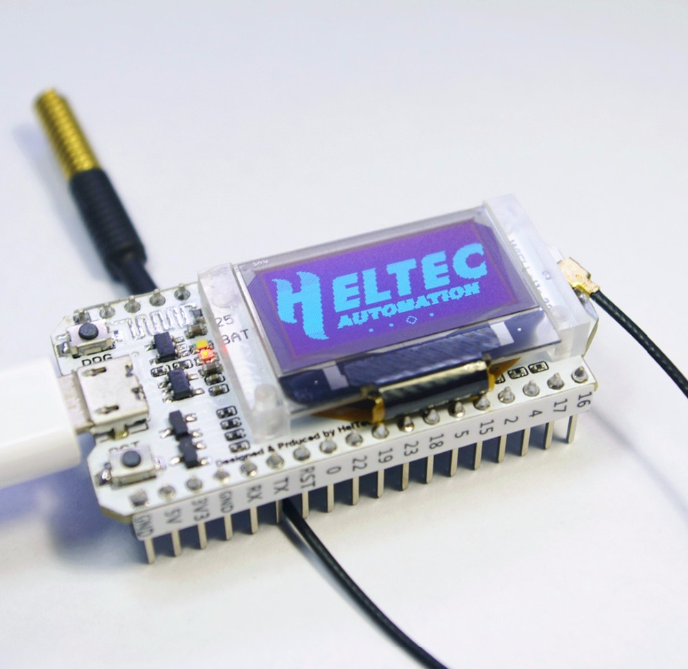

These solution ideas are mainly to see what sorts of things would work *practically* in a hospital environment.

### Problems with current disposable-stethoscope solution: ###
  - Stethoscopes are expensive and hard to disinfect, resulting in a situation where cheap, disposable stethoscopes are often left with
      a single patient for the duration of their stay (in developed countries). 
  - Disposable stethoscopes are low-quality (poorer sound).
  - Disposable stethoscopes wear out quickly.
  - Disposable stethoscopes are quite short, forcing the doctor closer to the patient, and for a longer time, than necessary.
  - A doctor in PPE gear like this will have a hard time getting a stethoscope into their ears.

### The goals for the "stethoscope" are: ###
  - ~~A simple "stethoscope" where the cup/puck/microphone is a separate unit, wirelessly and authentically transmitting patient
      ~~sounds to the doctor's ears.
  - A doctor needs to hear a patient's lungs and heart in a hospital setting.
  - This needs to be easily functional while the doctor is fully dressed in PPE.
  - ~~Around-the-ear headphones to fit over hoods and PPE gear, although any style headphones could be used in non-pandemic situations.
  - Easily sterilizeable.

  - Made of parts we can source to make a sizeable quantity.
  - Get it done - as quick a turnaround as possible.
  
### Conjectures (need clarification/correction): ###
  - A small microphone/transmitter puck that could be taped to the patient while they are being intubated frees up one of the doctors' hands.

### Constraints: ###
  - Relatively inexpensive.  Such as, in the range where parts of the device(s) that come in contact with the patient
    are effectively disposable.
  - Easily sterilizeable, or be placed in a container/wrapping that is easily sterilizeable while still functioning.
  - Durable with a long battery life.
  - Dead simple to configure, as few failure points as possible.
  - Maximizes the distance from the patient, and/or minimizes the amount of time spent near the patient.

### Other: ###
- If something works or doesn't work in the hospital setting currently, there's probably a really good reason for it.
- Don't re-engineer anything we don't have to.

### Questions: ###
- Do hospitals deal well with things that require batteries or charging?  Would it be better if the puck/microphone device could be
  plugged in and left on/near the patient as part of the station?
- Do doctors regularly use phones/tablets for per-patient equipment in emergency situations? In other words, are there existing
  phones/tablets in this environment already that we could use to pair with a cup/puck and headphones?
- Can a standard off-the-shelf Ziploc sandwich bag be used as a quick-and-dirty disposable sterilizeable protective shield on the device between patients?
- Can a surgical rubber glove (tied in a knot) be used as a quick-and-dirty disposable protective shield on the device between patients?
- I assume that *someone* will need to get close enough to the patient to hold the device to different areas of the patient's 
  chest/back. Is that correct? Does that person need to be the doctor? How important is it really to have a wireless connection vs.
  an arms-length cable?
- Would the doctor desire to tape a cup/puck unit to the patient and leave it there to free up hands while listening?
- What do doctors currently use for pulse oximetry, and how is it sterilized between patients?

### Solution Space 1:   Quick and Simple and Dirty - Stethoscope Only ###

Why do we need headphones? The absolute simplest design would be a puck with a microphone, a battery-powered amp, and a speaker.
Lowest level of technology, more fool-proof, no configuration.  Could be taped in place while the patient is being intubated.
As long as the sound quality is acceptable for the doctor's use,  the doctor (and anyone else) wouldn't need headphones to hear.
Less equipment to charge, carry around, and sterilize.

Picture something like this, except smoother and flatter:

Questions:
  - Would the sound level be acceptable in a hospital environment?  Or conversely, would a noisy hospital environment drown out the speaker?
  - Nonetheless, would this be a workable tradeoff for a dirt-simple, cheap solution?
  - What if these were used mainly during intubating, but we had a more traditional stethoscope-type solution for lower-stress procedures?
  

### Solution Space 2:   Existing Stethoscope Solutions - Stethoscope Only ###

This is the Stemoscope:  https://www.stemoscope.com/

It's functionally everything we want in a puck - picks up sounds with a good microphone and transmits them wirelessly to a
  headphone/speaker.  If we go the wireless headphone route we should absolutely use this if we can solve or waive the following issues:
- The current cover can't be effectively sterilized - too many slots and holes.  Would need to buy coverless and make new
    smooth/waterproof covers, or get the manufacturer to create a new design.
- It requires an expensive phone or device to be the master of the system and connect to both the puck and the headphones, for a total of 3 devices.
- More wireless connections == more configuration and more points of failure.
- Availability.

Pros:
- The most flexible option allowing for selection of different pucks and headphones.
- It physically exists as a current product.
- Software development is done.

Questions:
  Instead of being sterilized, could it be enclosed in a plastic bag that could be sterilized?  Would this work in a hospital environment?
  

Notes:
  Michael Vang/mvang said they would contact Stemoscope to see about collaboration possibilities. (3/28)

### Solution Space 3:   Reuse the stethoscope/cup - Stethoscope Only ###

Idea:  Use an existing stethoscope cup.  There are devices on the market that attach to the tube/cup of an
existing stethoscope, like this:

They are, however, very expensive (that one is $200/unit).  If this general solution is workable, we could possibly negotiate with
  the company or create our own similar solution.

Pros:
  - This re-uses the tried-and-true stethoscope so we don't have to re-engineer.
  - Exists physically as an FDA-cleared product.
  
Cons:
  - Looks unwieldy, hard to operate with one hand?
  - Dependent on existing stocks of stethoscopes.

Optional:  We wouldn't even need the rest of the stethoscope.  We could use existing stethoscopes and just cut off the headpiece (although that's wasteful), or just source stand-alone stethoscope cups and attach our own tubes,

### Solution Space 4:   Create Our Own Puck with integrated cup - optional Oximeter ###

If Stemoscope (or other similar option) doesn't work, we can create our own puck.  The puck would master the system, connecting via
  a wireless link to a pair of headphones worn by the doctor.  It would likely need a small screen and a couple buttons to select/pair
  with the headphones.

Idea:  Create our own stethoscope puck that can be a bluetooth master.  There are existing [ESP32](https://smile.amazon.com/gp/product/B076KJZ5QM/ref=ox_sc_act_title_1?smid=A1N6DLY3NQK2VM&psc=1) controller boards that we could source
for development, and possibly even for production.  These contain a bluetooth master, a lithium battery controller, and a small screen
for ~$17 single-unit price plus some cost for an antenna - I assume we could get cheaper antennas than this.

Pros:
  Solution requires only the puck and headphones.
  
Cons:
  Custom solution - requires custom case and custom software development.
  
Could end up looking something like this, or maybe a more compact puck-shaped solution:

There are ESP32 microcontroller boards with built-in Bluetooth mastering that could be used, that come with a microphone and battery charging controller.  These could also control the reflective-mode oximeter logic if we go that route.

### Solution Space 5:   Puck with Integrated Blood Oximeter ###
 
Clarify the original problem statement/use models - we need more information about how having an integrated blood oximeter would work.  Would the doctor generally read the oximeter *while* listening to the patient?  Would the puck have a digital readout, or provide some audio queue?  Are there times when you would want to listen and use the oximeter on the patient at different sites at the same time?

Existing finger-clip oximiters on Amazon are around $20.  Are they too expensive, hard to disinfect, or why are these not a good hospital solution?  Do you know what models are currently in use?

This is a good article on relective-mode oximetry:  https://www.sciencedirect.com/science/article/pii/S2405959516301205

Apparently fingertip/earlobe oximetry is "transmissive mode" oximetry.  "Reflective mode" oximetry is possible at the wrists or other sites, so this could theoretically be integrated into a stethoscope puck. The hardware is different than transmissive-mode solutions, I don't see any commercially available.  The circuit doesn't look that hard, could possibly prototype using the ESP32 as the microcontroller:

From https://core.ac.uk/download/pdf/81961664.pdf, page 2:

### Other interesting data points:###
  - Cheap bluetooth converters are all over the market that let you plug in a pair of *wired* headphones.  Like [these](https://smile.amazon.com/APEKX-Bluetooth-Headphones-Wireless-Hands-Free/dp/B01MUXYVOA/ref=sr_1_3?crid=8LU8JAFJEWS0&keywords=bluetooth+adapter+headphones&qid=1585470679&sprefix=bluetooth+adapter+head%2Caps%2C211&sr=8-3):
  - There are reasonable-looking 3D-printer plans for stethoscopes, such as:  https://all3dp.com/3d-printed-stethoscope/
  - There are reasonable-looking 3D-printer plans for over-the-ear headphones, such as:  https://www.instructables.com/id/3D-Printed-Bluetooth-Headphones/

 
